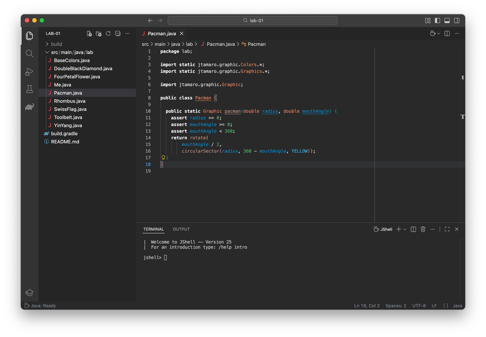

# PF2 PowerPack for VSCode

## Features

- PF2 Color Schemes (dark and light)
- Integration between Gradle and JShell extensions
- Environment setup diagnostics

## Install

- **Marketplace**
  - [Visual Studio Marketplace](https://marketplace.visualstudio.com/items?itemName=luceresearchlab.pf2-powerpack)
  - [OpenVSX Registry](https://open-vsx.org/extension/luceresearchlab/pf2-powerpack)
- **Manually** (from GitHub Actions)
  1. Download and extract the `vsix` file from the GitHub actions [artifacts](https://github.com/LuCEresearchlab/pf2-powerpack/actions/workflows/build.yml)
  2. Execute `code --install-extension path/to/pf2-powerpack-$VERSION.vsix`
  3. Open a new VSCode instance

## Other

- For build instructions, see [BUILD.md](./BUILD.md)
- For notable changes, see [CHANGELOG.md](./CHANGELOG.md)
- For license, see [LICENSE](./LICENSE)
